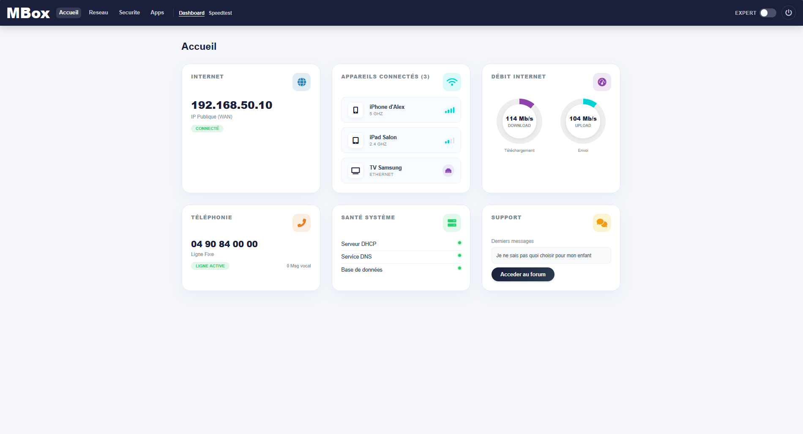
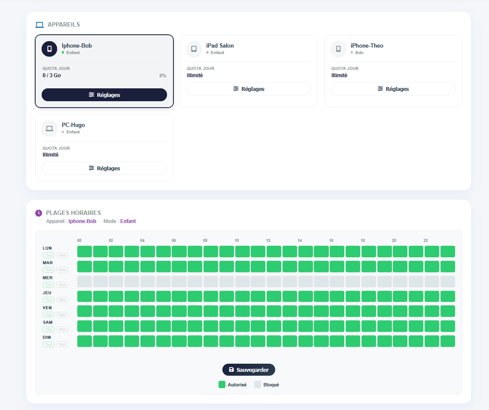
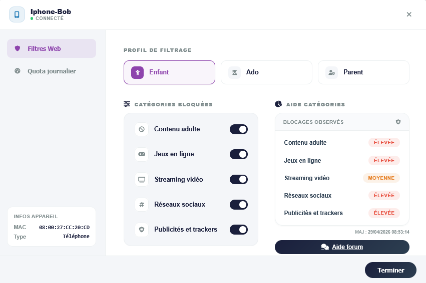

# MBox - Interface d'Administration Réseau

Interface web d'administration réseau développée dans le cadre du projet AMS, permettant la gestion DNS, DHCP, le contrôle parental et la supervision du réseau.

## Fonctionnalités

- **Contrôle parental** : profils par appareil (Enfant / Ado / Parent), filtrage par catégories, quotas journaliers, plages horaires
- **Gestion DNS** : configuration, blacklist/whitelist, filtrage RPZ, détection de typosquatting (distance de Levenshtein)
- **Gestion DHCP** : baux statiques et dynamiques, configuration avancée
- **Supervision** : historique des blocages, logs, test de débit
- **Forum intégré** : espace d'échange pour les utilisateurs
- **Authentification** : login sécurisé, mode expert

## Captures d'écran

### Page d'accueil


### Contrôle parental - Appareils et plages horaires


### Contrôle parental - Filtres web par profil


## Structure du projet

```
.
├── bin/
│   ├── bash/          # Scripts shell (DNS, DHCP, contrôle parental...)
│   ├── python/        # Scripts Python (filtrage Levenshtein, normalisation)
│   └── sql/           # Scripts SQL
├── config/
│   ├── .env.example   # Template de configuration (copier en .env)
│   └── env_loader.php
├── includes/          # Modules PHP partagés (auth, DB, navbar...)
├── public/            # Pages web accessibles
│   └── assets/        # CSS, JS, images
└── data/              # Données runtime (non versionnées)
```

## Installation

### Prérequis

- PHP 8.x
- MySQL / MariaDB
- Bind9 (DNS)
- ISC DHCP Server
- Python 3 (pour les scripts de filtrage)

### Configuration

```bash
# 1. Cloner le dépôt
git clone <url-du-repo>
cd mbox

# 2. Copier et remplir la configuration
cp config/.env.example config/.env
# Éditer config/.env avec vos paramètres DB

# 3. Importer la base de données
mysql -u root -p < bin/sql/schema.sql

# 4. Déployer dans votre répertoire web (Apache/Nginx)
```

## Auteur

**Miaille Alexi** - Projet AMS, 2026
